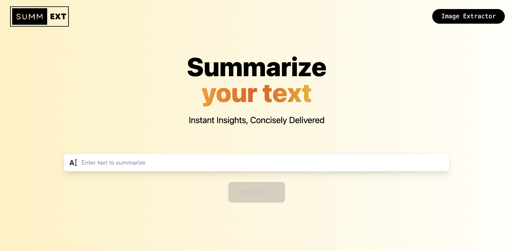
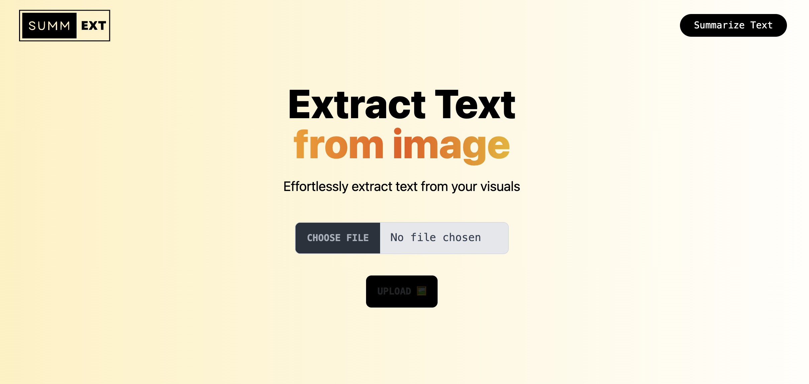
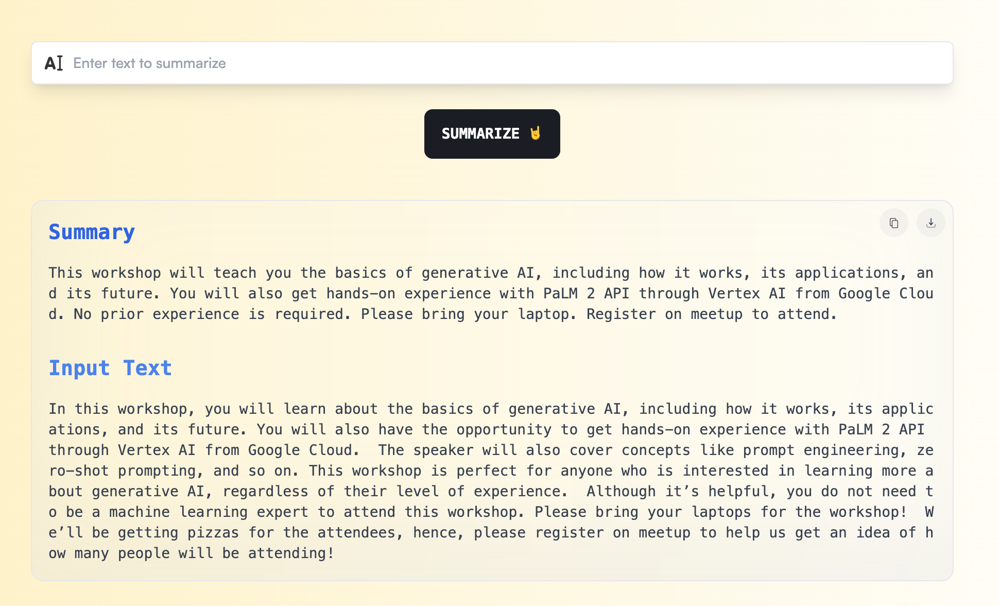

# SummExt 📖 🎯

[](https://summext.flatteredwithflutter.com/)

Have you ever found yourself drowning in a sea of lengthy articles or struggling to extract text from images? Well, fret no more because we're about to introduce you to a game-changing tool that will revolutionize the way you work – Introducing `SummExt`

## Features

- **Text Summarize📝**: Copy and paste any text you want to summarize into the input bar here. Watch the magic happen as SummExt quickly analyzes the content and generates a concise summary without losing the key points. This not only saves you time but also helps you grasp the main ideas at a glance.
Under the hood, this is being powered by Firebase AI Extension - Summarize Text which uses the Palm API

- **Extract Text from Image📝**: Have you ever needed to extract text from an image? Maybe it's a screenshot, a scanned document, or even a photo of a handwritten note. With SummExt, it's a breeze. Simply upload the image, and let the tool work its magic.
Under the hood, this is being powered by Firebase AI Extension - Extract Image Text which uses the Cloud Vision AI

## Video 🎥

[](https://www.youtube.com/watch?v=OjlPaqVa-dQ)

## Screenshots

| Summarize Screen                                                          | Extract Screen                                                          | Summarizer                                                          |
| ---------------------------------------------------------------------- | --------------------------------------------------------------------- | -------------------------------------------------------------------- |
|  |  |  |


## Getting Started 🚀

Before running this code, you need to create a Firebase project and copy [your credentials](https://firebase.google.com/) to `.env` file in the following format

```env
VITE_FB_API_KEY=
VITE_FB_AUTH_DOMAIN=
VITE_FB_PROJECT_ID=
VITE_FB_STORAGE_BUCKET=
VITE_FB_SENDER_ID=
VITE_FB_APP_ID=
```

To get started with the project, follow these steps:

1. Clone the repository
2. Install dependencies:

```bash
npm i
```

3. You can run this on iOS, Android or the Web.

```bash
npm run dev
```

## Future Enhancements 🌐

Here are some potential future enhancements that can be implemented in `SummExt`:

1. **Summarizing customer feedback :📊** which can be used by any e-commerce platforms.
2. **Abstracting long articles:🎯** which can be used by news website helping readers to decide whether they want to read the full article.
3. **Condensing user-generated content:📊** which can be used by social media platforms to improve content discoverability, user engagement and above 18 yrs content filteration.
4. **Optical character recognition:⏰** for scanned documents: Extract and store text from scanned documents to make them searchable and accessible in your application.

Let's keep building and improving `SummExt` together! 🚀

## Contact 💡

If you have any questions or suggestions, feel free to reach out to:

- [Ruchi Dhar](https://twitter.com/ruchidhar007)
  [](https://github.com/ruchidhar) [](https://twitter.com/ruchidhar007)

- [Aseem Wangoo](https://twitter.com/aseemwangoo)
  [](https://github.com/aseemwangoo) [](https://twitter.com/aseemwangoo)

And there you have it, folks! `SummExt` is here to transform the way you interact with information. Say goodbye to information overload and hello to efficiency and productivity.
